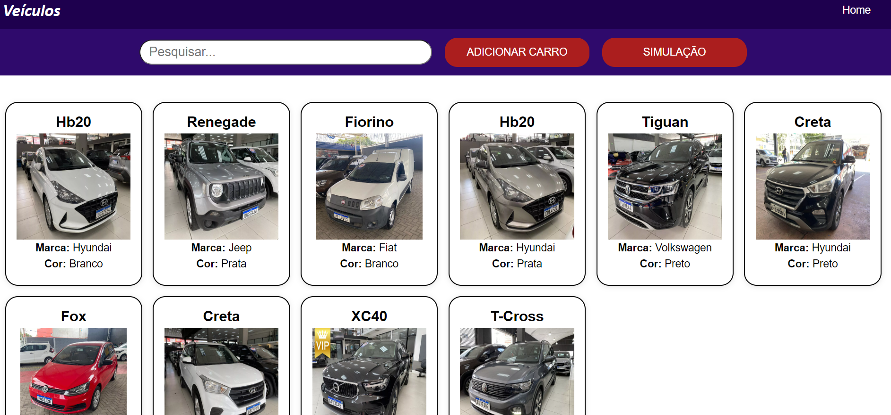

<h2 align="center">
 📱 Veículos
</h2>

<h4 align="center"><a href="https://front-oncar.vercel.app/">Clique para visitar o projeto</a></h4>

Este é um projeto Full Stack em Typescript que utiliza o React para o frontend, NestJs com TypeORM para o backend, banco de dados PostgreSQL.



## 🎯 Tecnologias utilizadas

- React
- TypeScript
- NestJs
- TypeORM
- PostgreSQL

## 🕹️ Funcionalidades

- Cadastrar um veículo
- Pesquisar um veículo
- Excluir um veículo
- Visualizar informações do veículo
- Simular score do usuário

## ⚙️ Como executar

# Backend

Após clonar o repositório, acesse a pasta do projeto, adicione o arquivo .env e preencha as informações:

```sh
DATABASE_HOST=
DATABASE_PASSWORD=
DATABASE_USERNAME=
DATABASE_NAME=
```

e execute os comandos abaixo:

```sh
yarn
yarn start:dev
```

# Frontend

Após clonar o repositório, acesse a pasta do projeto adicione o arquivo .env e preencha as informações:

```sh
REACT_APP_API_URL=
```

e execute os comandos abaixo:

```sh
yarn
yarn start
```

Acesse http://localhost:3000 para visualizar a aplicação.
